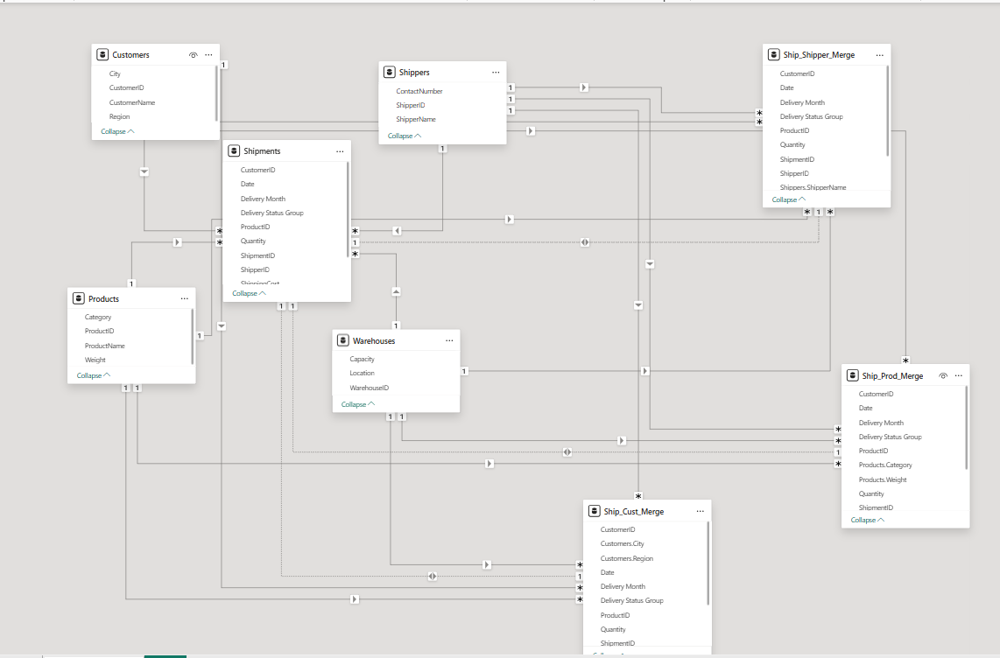
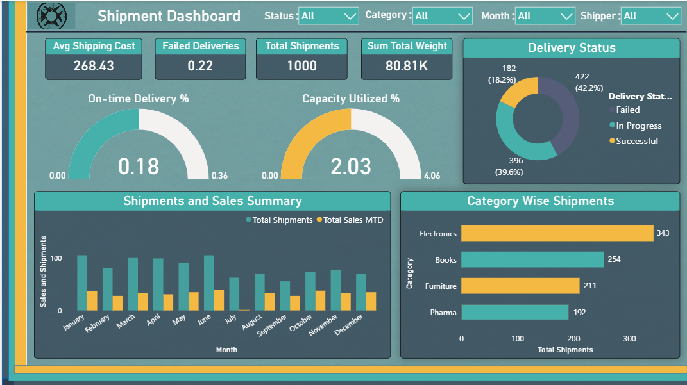

# 📊 Power BI Dashboard Project: Shipment Analytics & Optimization

---

## 📘 Overview

This Power BI dashboard is designed to provide comprehensive insights into the **shipment operations** of a logistics network. The report helps stakeholders understand patterns in shipping cost, delivery performance, regional trends, and warehouse efficiency.

It focuses on **KPI tracking**, **category-wise analysis**, and **temporal trends** to support data-driven decision-making for logistics and supply chain teams.

---

## 🎯 Key Features

### 🚚 Shipment Analysis

* Total Shipments, Total Weight, and Returned Shipments
* Cost per Item, Average Shipping Cost
* On-Time Delivery Percentage & Returned Rate

### 📦 Product & Category Breakdown

* Shipment volumes by Category
* Weight analysis by Product
* Filtering by Region and Customer

### 🏢 Warehouse Insights

* Capacity utilization by warehouse
* Region-wise logistics contribution
* Shipment storage distribution

### ⏱️ Time Intelligence

* Monthly, Quarterly, and Year-to-Date shipment trends
* Year-over-Year comparisons
* Interactive slicers for calendar navigation

---

## 🧱 Data Model & Structure

This dashboard follows a **star schema** model with a single fact table and multiple dimension tables, ensuring clean relationships and optimal performance.

### 📎 Fact Table

* `Shipments`

### 📚 Dimension Tables

* `Customers`
* `Products`
* `Shippers`
* `Warehouses`
* `Calendar`

---

## 🔗 Cardinality & Relationships

All table relationships are **one-to-many (1:\*)** with single direction flow from dimension to fact table.

* ✅ `Customers[CustomerID]` → `Shipments[CustomerID]`
* ✅ `Products[ProductID]` → `Shipments[ProductID]`
* ✅ `Shippers[ShipperID]` → `Shipments[ShipperID]`
* ✅ `Warehouses[WarehouseID]` → `Shipments[WarehouseID]`
* ✅ `Calendar[Date]` → `Shipments[Date]`

📎 **Cardinality View Screenshot**:

---

## 🖥️ Main Dashboard

This is the final user-facing dashboard, showcasing high-level KPIs and trends, optimized for clarity and business storytelling.

📊 **Main Dashboard View**:

---

## 📈 Business Impact

By implementing this dashboard, stakeholders can:

* ⏱️ **Reduce delivery delays** by monitoring on-time vs late shipments
* 💰 **Optimize cost** through better control of cost per item and shipping rates
* 📦 **Improve warehouse efficiency** with capacity and region-wise views
* 🔍 **Identify performance gaps** by shipper, region, or category
* 📊 **Enable strategic planning** with accurate MTD, QTD, YTD, and YoY trends

---

## 🧠 DAX Highlights

The dashboard includes a variety of **custom DAX measures**, including but not limited to:

* `Total Shipments`
* `Total Sales MTD`
* `Returned %`
* `On-Time Delivery %`
* `Avg Shipping Cost`
* `YoY Shipment Change`
* `Category-wise Contribution %`

These measures are optimized for **filter context awareness** and **time intelligence calculations**.

---

## 🛠️ Challenges & Solutions

| Challenge                                              | Solution                                                               |
| ------------------------------------------------------ | ---------------------------------------------------------------------- |
| Inconsistent data entries (e.g., blank customer names) | Applied Power Query transformations with Trim, Clean, and Null filters |
| Missing date values for shipments                      | Created a robust Calendar table with full date coverage                |
| Multiple filtering layers needed                       | Implemented slicers with sync and responsive design                    |
| Performance slow with large data                       | Used aggregations and optimized DAX for row context control            |

---

## 🔍 Proof of Ethical Work

All work presented in this dashboard:

* Was created with full transparency and original logic.
* Uses no copied or scraped proprietary models or datasets.
* Follows best practices in data modeling, transformation, and visualization.
* Aligns with ethical guidelines for fairness, traceability, and explainability.

🧾 **Ethical Declaration Screenshot/Document**:

---

## 📁 Project Components

| Component         | Description                                 |
| ----------------- | ------------------------------------------- |
| Power BI File     | `.pbix` file with full data model & visuals |
| Calendar Table    | DAX-generated date table with YTD, QTD, MTD |
| DAX Measures      | KPI calculations for trends, rates, targets |
| Power Query Steps | Merges, cleanups, and calculated columns    |
| Visual Layout     | Responsive, filterable, and user-friendly   |

---

## 🧰 Future Enhancements

* 📦 **Add inventory tracking** alongside shipments
* 🧠 **Integrate predictive analytics** using Power BI and Python R scripts
* 📍 **Geo-mapping** of delivery routes for spatial insights
* ⚙️ **Auto-refresh integration** via Power BI Service and scheduled gateway
* 📲 **Mobile-optimized view** for field managers and warehouse leads

---

## 🧠 Tools & Technologies

* **Power BI Desktop**
* Power Query (M)
* DAX
* Star Schema Design
* Data Modeling
* Custom Colors & Themes

---

## 📌 Setup Instructions

1. Open the `.pbix` file in Power BI Desktop.
2. Review the model in the *Model View* tab.
3. Interact with slicers and visuals in the *Main\_Dashboard* tab.
4. Inspect Power Query transformations under *Transform Data*.
5. Analyze the DAX logic via *Modeling → Manage Measures*.

---

## 🙌 Credits

Created by: **\[Your Name]**
Date: **\[July 2025]**
License: MIT / Personal Use / Educational Purposes *(modify as applicable)*

---

Let me know if you'd like a **readme version** or a **PDF version** for portfolio sharing.
